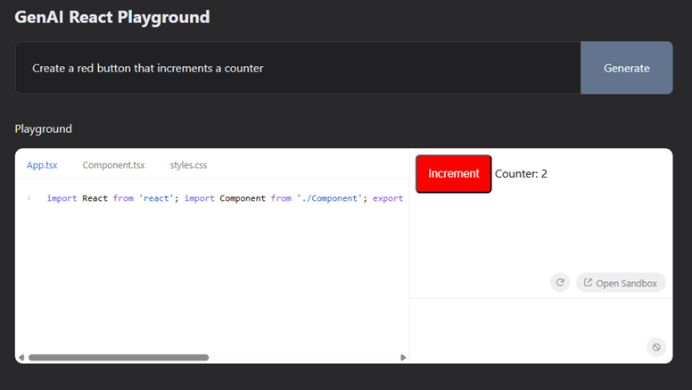

# GenAI React Playground



### The app uses an LLM to generate React components on the fly

<br />

# Information

- A sandbox where users type prompts
- Text input where AI returns React component.
- Sandbox runner with sandpack-react.
- AI streaming to see code appear as it’s generated.

#  Install and usage

```bash
npm i

cp .env.example .env.local and add OPENAI_API_KEY

npm run dev
```

# Technologies

- Next.js
- OpenAI (gpt-4o-mini model)
- sandpack-react
- TailwindCSS
